# 🌍 Life Expectancy Prediction using Machine Learning

Predicting life expectancy is an important problem in public health, economics, and policy planning. This project analyzes global health and socio-economic indicators to understand the factors affecting life expectancy and builds machine learning regression models capable of predicting the expected lifespan of a country's population.

The project performs comprehensive data cleaning, exploratory data analysis (EDA), feature engineering, feature scaling, and model building using **Linear Regression** and **Random Forest Regression**, followed by detailed model evaluation and interpretation.

---

## 📌 Project Overview

Life expectancy is influenced by numerous factors including healthcare quality, mortality rates, vaccination coverage, education, economic development, and disease prevalence.

This project aims to:

- Analyze worldwide life expectancy data
- Handle missing values using country-wise statistics
- Engineer meaningful features
- Visualize important relationships between variables
- Build regression models to predict life expectancy
- Compare linear and ensemble learning approaches
- Identify the most influential factors affecting life expectancy

---

## 📂 Dataset

**Dataset Source**

https://www.kaggle.com/datasets/victoria1199/lifespan-prediction

The dataset contains health, demographic, economic, and immunization statistics collected from multiple countries over several years.

### Dataset Summary

| Property | Value |
|----------|------:|
| Total Records | 2,938 |
| Total Features | 22 |
| Target Variable | Life Expectancy |
| Country Coverage | Multiple Countries |
| Time Period | 2000 – 2015 |

---

# ⚙️ Technologies Used

- Python
- NumPy
- Pandas
- Matplotlib
- Seaborn
- Scikit-learn
- PyCountry
- PyCountry Convert

---

# 📊 Data Preprocessing

Several preprocessing techniques were applied before model training.

## Column Cleaning

- Converted all column names to lowercase
- Removed spaces
- Standardized naming convention using underscores

---

## Missing Value Handling

Different strategies were used depending on the feature.

### Rows Removed

Rows containing missing values in:

- Life Expectancy
- Adult Mortality

were removed because these are essential variables.

---

### Country-wise Median Imputation

Missing values were filled using each country's median for:

- Alcohol
- Hepatitis B
- BMI
- Polio
- Total Expenditure
- Diphtheria
- GDP
- Population
- Thinness (1–19 Years)
- Thinness (5–9 Years)
- Income Composition of Resources
- Schooling

---

### Status-wise Median Imputation

If an entire country's values were unavailable, the missing values were replaced using the median of the country's development status:

- Developed
- Developing

---

# 📈 Exploratory Data Analysis

The project includes several visualizations to understand the data.

## Target Distribution

Shows the distribution of life expectancy across all countries.

<p align="center">
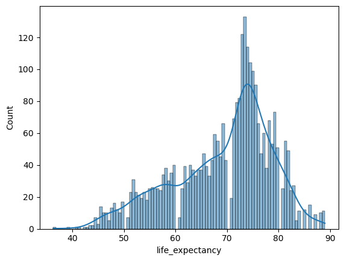
</p>

---

## Top 20 Countries by Average Life Expectancy

<p align="center">
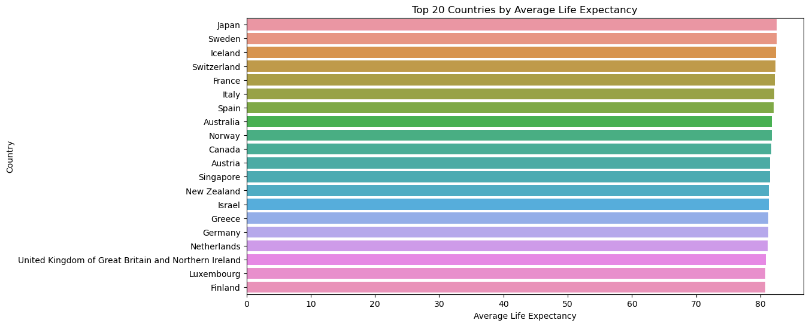
</p>

---

## Life Expectancy by Development Status

Comparison between developed and developing nations.

<p align="center">
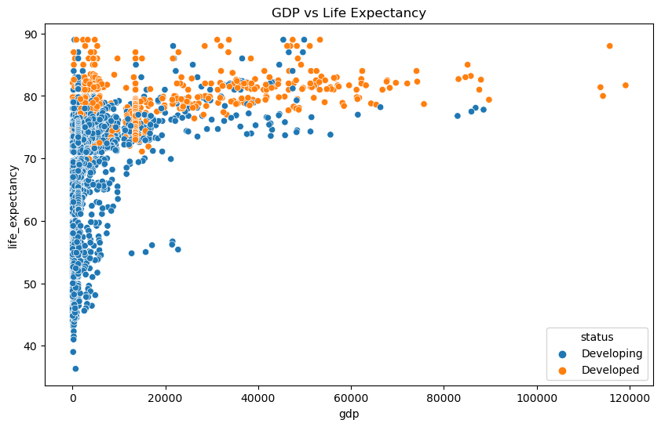
</p>

---

## Schooling vs Life Expectancy

<p align="center">
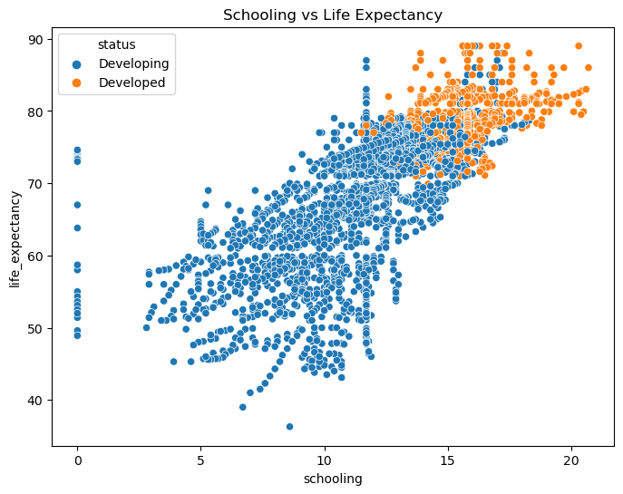
</p>

---

## Correlation Heatmap

Displays correlations among all numerical variables.

<p align="center">
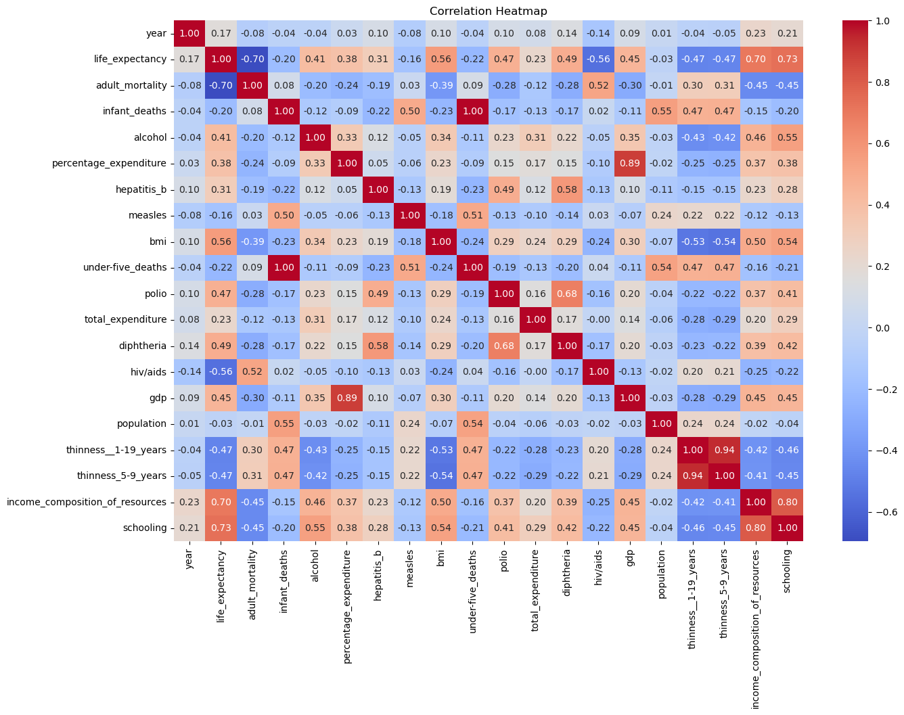
</p>

---

## Countries with Highest Improvement

Countries showing the greatest increase in life expectancy over time.

<p align="center">

</p>

---

## Global Life Expectancy Trend

Average global life expectancy over the years.

<p align="center">
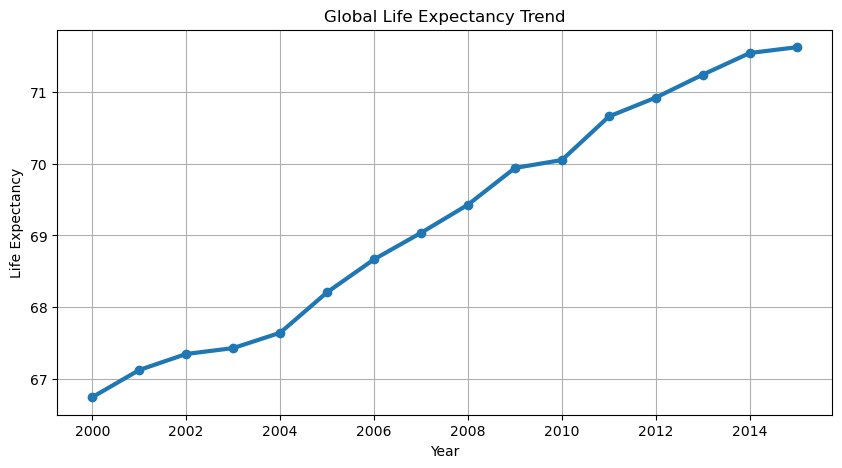
</p>

---

## Life Expectancy by Continent

<p align="center">
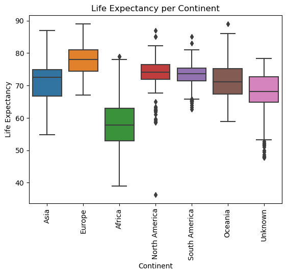
</p>

---

# 🧠 Feature Engineering

To improve model performance, several new features were created.

## Log Transformation

Highly skewed variables were transformed using **log1p()**:

- GDP
- Population
- Percentage Expenditure
- Measles

---

## Vaccination Coverage

Created a new feature:

```
Average Vaccination =
(Hepatitis B + Polio + Diphtheria) / 3
```

---

## Average Thinness

```
Average Thinness =
(Thinness 1–19 + Thinness 5–9) / 2
```

---

## BMI Categories

BMI values were grouped into:

- Underweight
- Normal
- Overweight
- Obese

---

## Continent Extraction

Using **PyCountry** and **PyCountry Convert**, every country was mapped to its respective continent.

---

# 🔤 Encoding

The following encoding techniques were applied.

### Label Encoding

Status

- Developing → 0
- Developed → 1

---

### One-Hot Encoding

Applied to

- Continent
- BMI Category

---

# 🎯 Feature Selection

The following columns were excluded before training:

- Country
- Year
- Infant Deaths
- Hepatitis B
- Polio
- Diphtheria
- Thinness (1–19)
- Thinness (5–9)
- Target Variable

Remaining engineered and numerical features were used for prediction.

---

# 📏 Feature Scaling

Standardization was applied using **StandardScaler** before training the Linear Regression model.

Random Forest Regression was trained using the original feature values since tree-based models do not require feature scaling.

---

# 🤖 Machine Learning Models

Two regression models were developed.

---

## 1. Linear Regression

Linear Regression models the relationship between independent variables and life expectancy using a linear equation.

### Performance

| Metric | Score |
|---------|------:|
| MAE | **2.826** |
| MSE | **13.584** |
| RMSE | **3.686** |
| R² Score | **0.8430** |

---

### Actual vs Predicted

<p align="center">
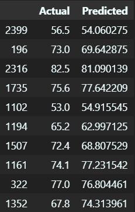
</p>

---

### Residual Plot

<p align="center">
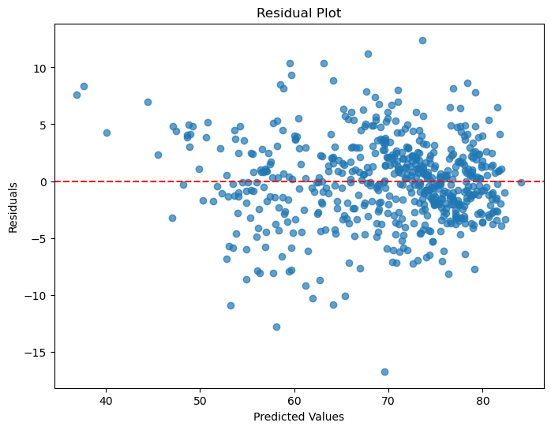
</p>

---

### Largest Positive Coefficients

| Feature | Effect |
|----------|--------|
| Europe | Strong Positive |
| Schooling | Positive |
| Asia | Positive |
| North America | Positive |
| Income Composition | Positive |
| Vaccination | Positive |
| GDP | Positive |

---

### Largest Negative Coefficients

| Feature | Effect |
|----------|--------|
| HIV/AIDS | Strong Negative |
| Adult Mortality | Strong Negative |
| Alcohol | Negative |
| Measles | Negative |
| Average Thinness | Negative |

---

## 2. Random Forest Regression

Random Forest Regression builds multiple decision trees and combines their predictions, allowing it to capture complex non-linear relationships.

### Performance

| Metric | Score |
|---------|------:|
| MAE | **1.052** |
| MSE | **2.842** |
| RMSE | **1.686** |
| R² Score | **0.9671** |

---

### Actual vs Predicted

<p align="center">
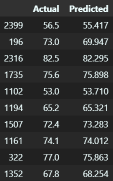
</p>

---

### Residual Plot

<p align="center">
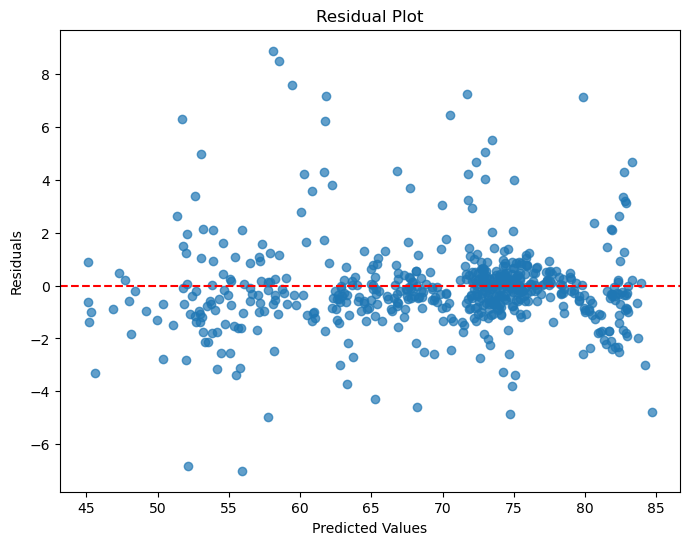
</p>

---

### Top Important Features

| Feature | Importance |
|----------|-----------:|
| HIV/AIDS | 0.587 |
| Income Composition | 0.192 |
| Adult Mortality | 0.115 |
| BMI | 0.018 |
| Under-five Deaths | 0.018 |
| Schooling | 0.015 |
| Average Thinness | 0.012 |
| Alcohol | 0.009 |
| Total Expenditure | 0.006 |
| Average Vaccination | 0.005 |

---

### Feature Importance Plot

<p align="center">
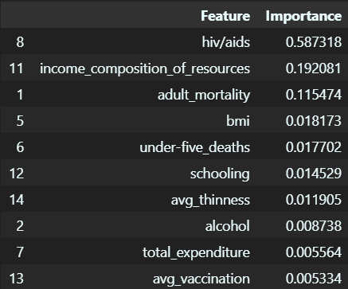
</p>

---

# 📊 Model Comparison

| Metric | Linear Regression | Random Forest |
|---------|-----------------:|--------------:|
| MAE | 2.826 | **1.052** |
| RMSE | 3.686 | **1.686** |
| MSE | 13.584 | **2.842** |
| R² Score | 0.8430 | **0.9671** |

Random Forest Regression significantly outperformed Linear Regression, indicating that the relationship between life expectancy and the predictor variables is highly non-linear.

---

# 📌 Key Findings

- Developed countries generally have higher life expectancy.
- Higher education levels are strongly associated with longer lifespans.
- Countries with greater GDP tend to have better life expectancy.
- HIV/AIDS prevalence is the strongest negative predictor.
- Adult mortality substantially reduces life expectancy.
- Higher vaccination coverage contributes positively.
- Income composition is one of the most influential socio-economic indicators.
- Random Forest effectively captures the complex relationships within the data and provides highly accurate predictions.

---

# 🚀 Future Improvements

- Perform hyperparameter tuning using GridSearchCV or RandomizedSearchCV.
- Evaluate additional ensemble models such as XGBoost, LightGBM, and CatBoost.
- Apply cross-validation for more robust performance estimation.
- Investigate SHAP values for improved model interpretability.
- Deploy the best-performing model using Flask, FastAPI, or Streamlit.
- Build an interactive dashboard for real-time life expectancy prediction.

---

# ▶️ How to Run

```bash
# Clone the repository
git clone [<repository-url>](https://github.com/Hari-jith/Machine-Learning/Linear-Regression)

# Navigate into the project
cd Life-Expectancy-Prediction

# Install dependencies
pip install -r requirements.txt

# Launch Jupyter Notebook
jupyter notebook
```

---

# 📄 License

This project is intended for educational purposes, machine learning practice, and portfolio demonstration.

---

# 👨‍💻 Author

**Harijith M M**
